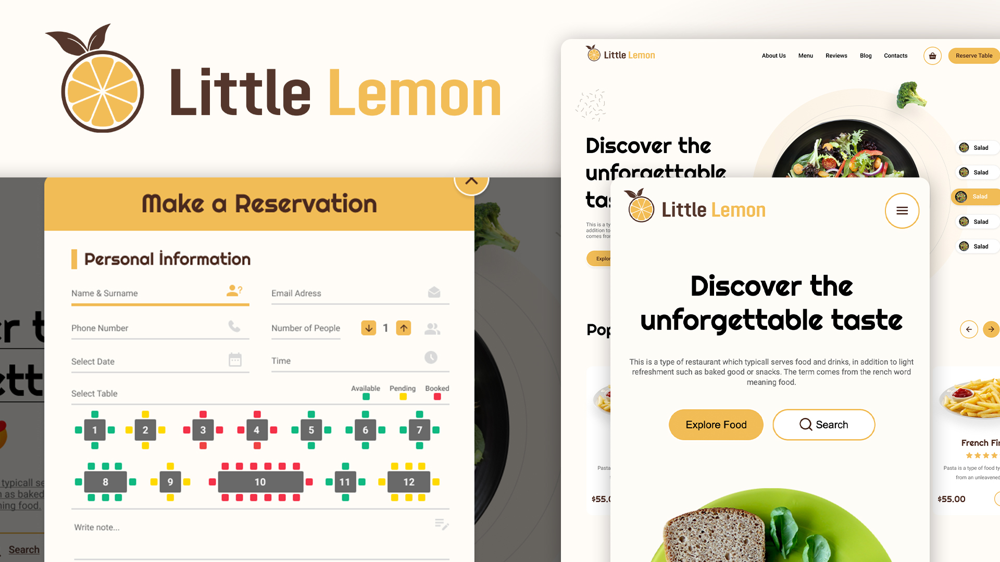

# Little Lemon - Reustorant & Booking

## Table of Content

- [Introduction](#introduction)
- [Preparatory Sage](#preparatory-sage)
    - [Wireframe](#wireframe)
    - [UI Design](#ui-design)
- [Features](#features)
- [Live Demo](#live-demo)
- [Screenshots](#screenshots)
- [Technologies](#technologies)
- [Todos](#todos)
- [Installation](#installation)
- [License](#license)

## Preparatory Sage

---

## Features

- Book a table
- Order food online
- View menu

---

## Live Demo

[Live Demo Link](https://azateser.github.io/little-lemon-finalProject/build)

---

## Screenshots

---

## Technologies

- ReactJS

---

## Todos

- [x] Figma wireframe design  
- [x] Figma UI design  
- [x] Create folder structure  
- [x] Create components  
- [x] Create pages  
- [x] Create routes  
- [x] Create styles  
- [x] Create assets  
- [x] Create README.md  
- [x] Header  
    - [x] Component  
    - [x] Responsive  
    - [x] States  
    - [x] Mobile Menu  
- [x] Slider  
    - [x] Component  
    - [x] Responsive  
    - [x] States  
- [x] Popular Dishes  
    - [x] Component  
    - [x] Responsive  
    - [x] States  
- [x] About Us  
    - [x] Component  
    - [x] Responsive  
- [x] Menu Section  
    - [x] Component  
    - [x] Responsive  
- [x] Reservation Section  
    - [x] Component  
    - [x] Responsive  
- [x] Mobile App Section  
    - [x] Component  
    - [x] Responsive  
- [x] Footer  
    - [x] Component  
    - [x] Responsive  
- [x] Reservation Modal  
    - [x] Component  
    - [x] Responsive  
    - [x] Booking System  
- [x] Deploy  

## Installation

- Clone the repository
- Run `npm install`
- Run `npm start`

